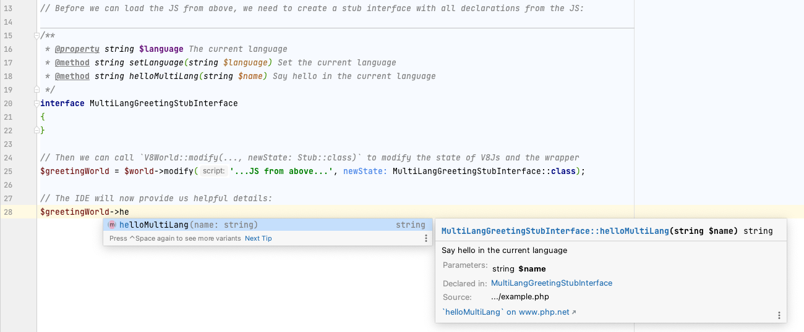

# V8 World

_A wrapper for the `v8js` extension._

## Why

### Without V8 World

### With V8 World

_\*: The real instance of objects is still an V8Object but the type hints will help you to reduce possible bugs._

## How?

1. The wrapper takes an instance of `\V8Js` + an `$initialState`[^1] class.
2. The phpdoc tells your IDE that the wrapper is an instance of `\V8Js&InitialState`.
3. Your IDE provides autocomplete features and your static analyzer should detect common typing problems.
[^1]: Usually this should be a stub interface

## Example
See [_docs/example.md](./_docs/example.md).

## Important notes
This package is just a "band-aid for a bullet hole".
- Since `V8World::modify()` will not create a new instance of the `V8Js` object, the old `V8World` is also affected
  - The IDE will not provide autocompletion for the old `V8World` object but for the new one.
- Keep in mind that changing the stubs will not affect the underlying JS code - not even vice versa.
- **Don't trust the stubs if you're working with objects and functions**.
  - If a method returns an object or a property holds an instance of an object, V8Js always return an `\V8Object`
  - If a method returns an function or a property holds an instance of an function, V8Js always return an `\V8Function`
