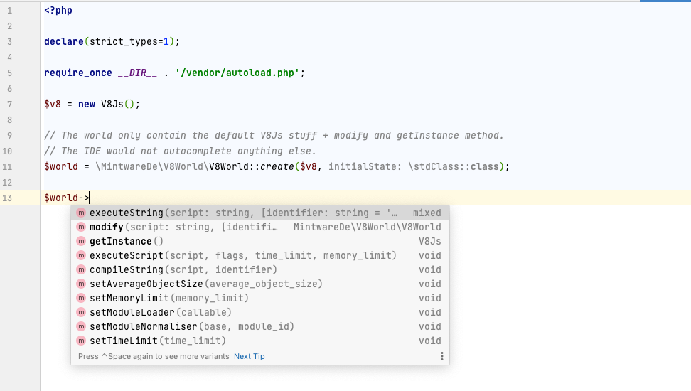
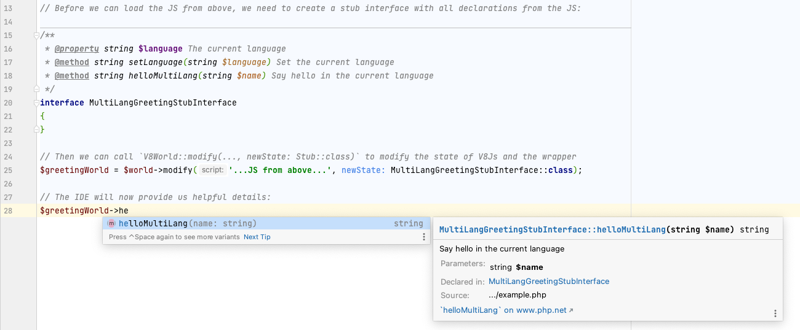
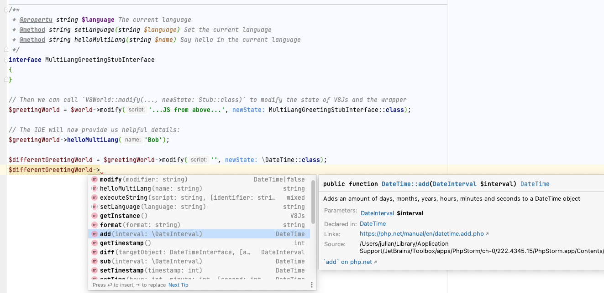

# Example

## JS Code

```javascript
let language = 'en';

function setLanguage(newLang) {
    language = newLang;
}

function hello(name) {
    switch (language) {
        case 'en':
            return `Hello ${name}!\n`;
        case 'de':
            return `Hallo ${name}!\n`;
        case 'fr':
            return `Salut ${name}!\n`;
    }
    return `Can not translate greeting to ${language}!\n`;
}
```

## PHP Code

### Stub
```php
/**
 * @property string $language The current language
 * @method string setLanguage(string $language) Set the current language
 * @method string helloMultiLang(string $name) Say hello in the current language
 */
interface MultiLangGreetingStubInterface
{
}
```

### Initial State

```php
<?php

declare(strict_types=1);

require_once __DIR__ . '/vendor/autoload.php';

$v8 = new V8Js();

// The world only contain the default V8Js stuff + modify and getInstance method.
$world = \MintwareDe\V8World\V8World::create($v8, initialState: \stdClass::class);

// The IDE would not autocomplete anything else. 
```


### Modify the world and type it with the created stub
```php

// Then we can call `V8World::modify(..., newState: Stub::class)` to modify the state of V8Js and the wrapper
$greetingWorld = $world->modify('...JS from above...', newState: MultiLangGreetingStubInterface::class);

// The IDE will now provide autocompletion:
```


### Incremental modifying
You can also call modify multiple times to append additional properties / methods:

